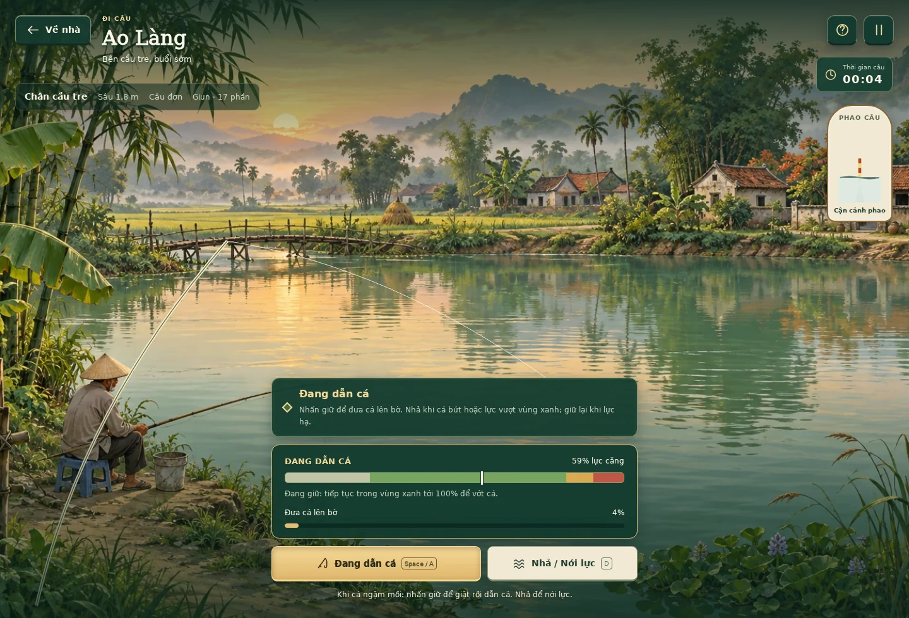

# Trốn Vợ Đi Câu

Một buổi câu bên bờ nước Việt Nam. Bản web **v0.1** chơi trực tiếp trên trình duyệt: chọn mồi, đọc phao, dẫn cá, bán hoặc thả rồi ghi lại thành tích.


## Giao diện game

Luồng **Nhà → Chuẩn bị → Đi câu**. Chọn map, góc bờ, cần và mồi trước khi ra câu. **Đi câu** phủ toàn màn hình, ẩn thanh điều hướng, cấp cần thủ, xu và menu quản lý; chỉ giữ cảnh nước, tín hiệu cá, đồng hồ và điều khiển. Tạm dừng để tiếp tục, chuẩn bị lại hoặc về nhà. Đồ nghề, sổ cá và chợ nằm ở nhà; cấp cần thủ tăng theo số cá đã câu.




## Đã chơi được

- 10 map với tranh nền riêng: Ao Làng, Kênh Đồng, Hồ Núi, Sông Bãi Bồi, Suối Đại Ngàn, Kênh Miền Tây, Hồ Dịch Vụ, Lòng Đập, Cửa Sông và Ghềnh Biển. Mỗi map có ba góc bờ, độ sâu, dòng nước và quần thể riêng; mở một lần bằng xu trong game.
- 50 loài cá; sổ cá lọc theo tên/map, ghi mồi, kỹ thuật, tầng nước, số lần gặp và kỷ lục. Cá được tạo khi vào map, tìm mồi theo loại mồi, kỹ thuật và tầng nước; cá không được tạo ở thao tác giật cần.
- 12 cần cho năm kỹ thuật: câu đơn, Đài, lure, câu đáy và ISO. 15 loại mồi, gồm giun, tôm, cá mồi, dế, ốc, rong, cám, nghêu và bốn mồi giả dùng lại.
- 20 phụ kiện thuộc dây, lưỡi, phao, máy và vợt. Lắp đúng bộ để tăng sức tải, mở rộng cửa sổ giật, ổn định dòng nước, tăng tốc dẫn hoặc vớt cá sớm.
- Phao rung, thăm mồi và chìm; giật sớm hoặc chậm đều có thể mất lượt. Cửa sổ giật cơ bản 2,8 giây, tăng theo lưỡi đang lắp; có gợi ý tùy chọn. Câu đáy và lure dùng tín hiệu đầu cần/dây.
- Cá bứt lực, dây quá căng có thể đứt. Câu tay dùng thao tác dẫn cá; bộ spinning dùng thu dây.
- Bán hoặc thả, sổ loài và thành tích khối lượng. Cá chưa quyết định bán/thả vẫn được giữ khi tải lại; mỗi giao dịch được xử lý một lần.
- Cửa hàng, ba bài học có thưởng lần đầu, cân phao, đào giun miễn phí và xuất bản lưu JSON.
- Lưu tự động trên trình duyệt, bàn phím, nút cảm ứng, giảm chuyển động và chế độ giờ về nhà 3 hoặc 5 phút.

Khởi đầu có cần tre, 12.000 xu và mồi. Xu hoàn toàn là tiền trong game. Không có tài khoản, thanh toán, quảng cáo hoặc dịch vụ máy chủ.

## Cách chơi

1. Chọn **Đi câu** tại nhà, giữ góc Chân cầu tre và mồi giun, rồi bấm **Bắt đầu đi câu**.
2. **Thả câu**, quan sát phao. Rung nhẹ chưa phải lúc giật.
3. Khi phao chìm rõ, **nhấn giữ Giữ để giật**. Cùng một lần giữ sẽ đóng lưỡi và bắt đầu dẫn cá.
4. **Tiếp tục giữ** để tăng tiến độ đưa cá lên bờ. **Nhả nút** khi cá bứt hoặc lực vượt vùng xanh; giữ lại khi lực giảm. Đạt 100% sẽ tự vớt cá; giữ liên tục ở vùng đỏ vẫn có thể đứt dây.
5. **Bán** để kiếm xu hoặc **Thả về ao**; cả hai đều giữ thành tích trong sổ cá.

Space thả câu; giữ Space để giật rồi dẫn, giữ A để dẫn, nhả phím để nới; D nới, P hoặc Esc mở menu tạm dừng. Esc trong hộp thoại đóng và quay lại buổi câu. Chuột và cảm ứng dùng cùng thao tác giữ/nhả; mở tạm dừng hoặc rời cửa sổ sẽ nhả lực. Với lure, cần **Bật thu mồi** trước khi cá tiếp cận.

Chọn **Tạm dừng → Chuẩn bị lại** để đổi map, góc bờ, cần hoặc mồi; dùng **Đồ nghề** để chỉnh phụ kiện và độ sâu. Rời bờ giữa lượt cần xác nhận thu cần; mồi đã thả không được hoàn lại. Chọn điểm mới tự dò độ sâu đáy; chỉnh lại tầng nông hơn để tìm cá giữa nước. Hết mồi và xu vẫn dùng cần tre, đào thêm giun miễn phí. **Bắt đầu buổi câu mới** trong menu tạm dừng khi chưa thả câu tạo lại quần thể và đặt lại đồng hồ; cũng có nút bắt đầu buổi mới khi đến giờ về nhà.

## Chạy tại máy

Cần Node.js 22 trở lên. Game không có thư viện chạy ở phía người chơi và không cần cài gói để phục vụ bản tĩnh.

```sh
npm start
```

Mở `http://127.0.0.1:5173/`. Phải phục vụ qua HTTP vì game dùng ES modules; không mở bằng `file://`.

```sh
npm test
npm run build
```

`dist/` chứa bản tĩnh đầy đủ. Kiểm tra đúng đường dẫn Pages:

```sh
node scripts/serve.mjs --base tron-vo-di-cau --port 5173
```

Mở `http://127.0.0.1:5173/tron-vo-di-cau/`.

Kiểm tra trình duyệt tự động tùy chọn:

```sh
npm ci
npx playwright install chromium
npm run test:browser
npm run test:browser:expansion
npm run test:browser:hold
```

Script dùng UI thật và đồng hồ ảo để chạy animation frames. Ảnh và báo cáo xuất tại `test-results/`. Có thể đặt `CHROMIUM_EXECUTABLE` khi đã có Chromium. Chi tiết kiểm chứng tại [docs/VERIFICATION.md](docs/VERIFICATION.md).

## Vercel

Repo đã có `vercel.json`: `npm run build` và Output Directory `dist`, Framework Preset **Other**. Push lên nhánh production sẽ kích hoạt triển khai qua Git integration đã kết nối. URL production lấy ở trang project Vercel; URL deployment riêng có thể yêu cầu đăng nhập nếu bật Deployment Protection.

## GitHub Pages

Repo phục vụ trực tiếp từ **main / (root)**. Tất cả assets và module dùng URL tương đối, không phụ thuộc domain gốc.

Nếu Pages chưa bật: **Settings → Pages → Build and deployment → Deploy from a branch → main → / (root) → Save**. Không cần custom domain hay khóa API. Sau khi GitHub báo build thành công, dùng URL hiển thị tại Settings → Pages. Workflow `Check game` kiểm tra cơ chế và bản đóng gói khi cập nhật main; Pages xây và xuất bản từ nhánh đã chọn.

## Cấu trúc

| Đường dẫn | Vai trò |
|---|---|
| `index.html`, `styles.css` | Khung trang, giao diện responsive và font Việt |
| `src/content.js` | Nội dung và cân bằng riêng của bản chơi web |
| `src/engine.js` | Quần thể cá, tìm mồi, phao, giật, dẫn cá và giao dịch |
| `src/save.js` | Bản lưu phiên bản 1, kiểm tra dữ liệu và dự phòng khi không đọc được |
| `src/app.js` | Canvas, âm báo, trợ năng và nối thao tác với engine |
| `src/ui.js` | Màn game, HUD, biểu tượng, ô trang bị và thẻ bộ sưu tập |
| `assets/` | Tranh riêng cho 10 map, ảnh nhỏ của map, font, favicon và giấy phép font |
| `tests/` | Kiểm thử cơ chế và vòng chơi qua trình duyệt |
| `scripts/` | Máy chủ local và đóng gói bản tĩnh |
| `docs/` | GDD, hệ thống thiết kế và kết quả kiểm chứng |

## Phạm vi v0.1

Đây là bản chơi web đầu tiên của [GDD v0.1](docs/GDD_v0.1.md), sử dụng UIUX Pro Max và phương pháp design-first/no-ai-design-slop của MengTo cho hướng giao diện. Bản mở rộng hiện triển khai đủ 10 map và 50 cá; có 12 cần, 15 mồi, 20 phụ kiện và 3 bài học. Kế hoạch 75 đồ và 15 bài trong GDD vẫn là phạm vi dài hạn. Chi tiết ảnh, địa hình và tác dụng đồ ở [docs/CONTENT_EXPANSION.md](docs/CONTENT_EXPANSION.md).

Mỗi map dùng tranh riêng, ảnh nhỏ trong bản đồ/chợ lấy từ đúng cảnh đó. Hình cá là SVG có dáng và hoa văn theo nhóm minh họa; mô hình tìm mồi và lực dây là mô phỏng 2D giản lược. Chưa có nhân vật 3D, mô phỏng nút buộc, thế giới mở, nhiều người chơi hoặc kiểm chứng hiệu năng native. Cân bằng riêng của bản web thay đổi giá đồ và cách mở map so với kế hoạch GDD. Dữ liệu kế hoạch giữ riêng ở `docs/data/`, không điều khiển bản chơi này.

Tiến độ lưu theo trình duyệt/domain, không đồng bộ giữa thiết bị. Xóa dữ liệu trình duyệt sẽ xóa tiến độ. Xuất JSON giữ được bản riêng, nhưng v0.1 chưa có chức năng nhập lại trong giao diện. Thời lượng buổi câu bắt đầu lại khi tải trang; cá đang kéo không giữ giữa hai lần tải, cá đã lên bờ thì được giữ để quyết định bán/thả.

Các mô tả sinh học, tên phân loại và phân bố trong GDD đang chờ rà soát chuyên gia. Game không đưa ra bảo đảm về kỹ thuật câu cá ngoài đời.

## Tài nguyên

10 tranh cảnh được tạo cho dự án; SVG cá, đồ nghề và biểu tượng được viết cho giao diện này. Font DejaVu được subset để có dấu Việt, kèm [giấy phép font](assets/FONT_LICENSE.txt). Thông tin tài nguyên và phương pháp ở [ATTRIBUTIONS.md](ATTRIBUTIONS.md). Repo chưa cấp giấy phép mã nguồn mở cho mã và nội dung gốc.
