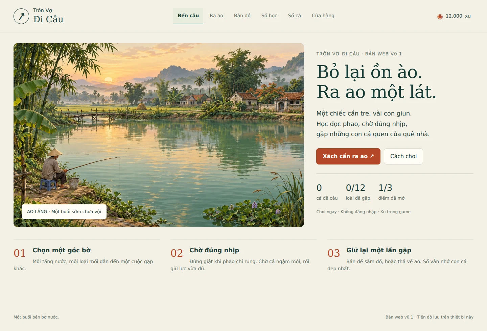
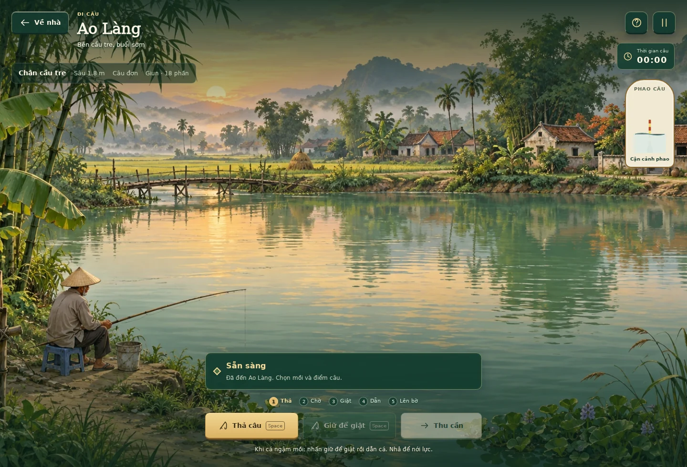
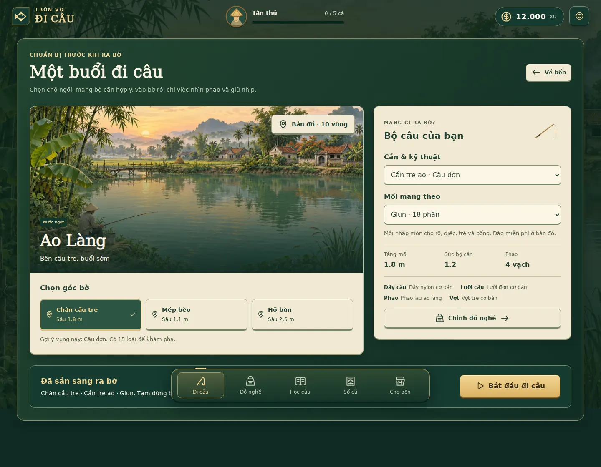
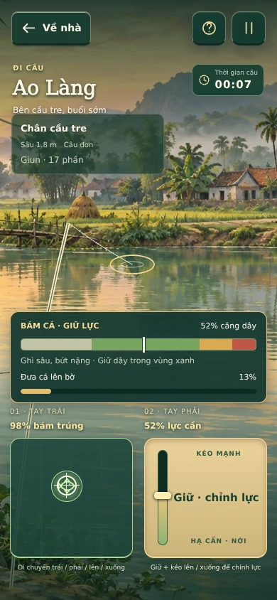

# Trốn Vợ Đi Câu

Một buổi câu bên bờ nước Việt Nam. Bản web **v0.2** chơi trực tiếp trên trình duyệt: chuẩn bị túi đồ, lắp mồi, đọc phao, dẫn cá rồi thả hoặc mang thành quả về nhà.



## Giao diện game

Luồng **Nhà → Chuẩn bị → Đi câu**. Chọn map, góc bờ, cần và mồi trước khi ra câu. **Đi câu** phủ toàn màn hình, ẩn thanh điều hướng, cấp cần thủ, xu và menu quản lý; chỉ giữ cảnh nước, tín hiệu cá, đồng hồ và điều khiển. Tạm dừng để tiếp tục, chuẩn bị lại hoặc về nhà. Ở bờ có thể đổi mồi và đồ đã mang qua Đồ nghề. Chuyển đồ từ kho, mua hàng và xử lý cá mang về thực hiện tại nhà; cấp cần thủ tăng theo số cá đã câu.







## Đã chơi được

- 10 map với tranh nền riêng: Ao Làng, Kênh Đồng, Hồ Núi, Sông Bãi Bồi, Suối Đại Ngàn, Kênh Miền Tây, Hồ Dịch Vụ, Lòng Đập, Cửa Sông và Ghềnh Biển. Ao Làng có hai bờ video, các map còn lại có ba góc bờ, độ sâu, dòng nước và quần thể riêng; mở một lần bằng xu trong game.
- 50 loài cá; sổ cá lọc theo tên/map, ghi mồi, kỹ thuật, tầng nước, số lần gặp và kỷ lục. Cá được tạo khi vào map, tìm mồi theo loại mồi, kỹ thuật và tầng nước; cá không được tạo ở thao tác giật cần.
- 12 cần cho năm kỹ thuật: câu đơn, Đài, lure, câu đáy và ISO. 15 loại mồi, gồm giun, tôm, cá mồi, dế, ốc, rong, cám, nghêu và bốn mồi giả dùng lại.
- 20 phụ kiện thuộc dây, lưỡi, phao, máy và vợt. Lắp đúng bộ để tăng sức tải, mở rộng cửa sổ giật, ổn định dòng nước, tăng tốc dẫn hoặc vớt cá sớm.
- Phao rung, thăm mồi và chìm; giật sớm hoặc chậm đều có thể mất lượt. Cửa sổ giật cơ bản 2,8 giây, tăng theo lưỡi đang lắp; có gợi ý tùy chọn. Câu đáy và lure dùng tín hiệu đầu cần/dây.
- Điều khiển hai tay độc lập: tay trái giữ và di chuyển theo dấu cá, tay phải giữ và kéo lên/xuống để điều chỉnh lực liên tục. Cá đổi hướng, bứt tốc và ghì lực theo loài; lệch mục tiêu, kéo quá căng hoặc để chùng đều có thể mất cá.
- 10 map có dòng nước, bọt, cành/lá trôi và cây tiền cảnh đung đưa. Mỗi map có mặt nạ vùng nước, tốc độ dòng và nguy cơ mắc đáy riêng theo góc bờ/tầng mồi. Có thể gỡ bằng hai tay hoặc bỏ lượt.
- Kho nhà và bốn loại túi với giới hạn cần, loại mồi và đồ dự phòng. Đồ mua mới ở kho; bộ đang lắp không chiếm ngăn dự phòng. Về nhà để chuyển đồ hoặc đổi túi.
- Chợ có thông số và so sánh với đồ đang dùng: sức cần, tải dây, đường kính, nhịp giật, sức nổi, độ ổn định, máy và vợt. Giao dịch và thưởng có mã chống xử lý lặp.
- Mồi lắp trên lưỡi giữ nguyên qua thả, chờ, thu cần và tải lại. Mồi tự nhiên chỉ tiêu khi bị ăn, mất hoặc thay; mồi giả dùng lại nhưng có thể mất khi đứt/mắc đáy.
- Bộ câu có dây trục, thẻo, phao, chì, lưỡi và mồi; chỉnh thẻo, cỡ lưỡi, khoảng cách chì và lưu tối đa 12 bộ. Phao cân theo thể tích chìm, tải mồi, điểm chạm đáy và dòng nước; cân sai giảm tín hiệu nhưng vẫn được câu. Cần đáy/lure không cần phao.
- Cá lên bờ chỉ **Giữ** hoặc **Thả**. Rọng, xô và thùng có giới hạn số con/khối lượng; đầy thì cá vẫn chờ quyết định. Về nhà để bán, nấu ăn hoặc nịnh vợ; mỗi con chỉ xử lý một lần, thành tích vẫn ở sổ cá.
- Mười bài thực hành tùy chọn ghi nhận kết quả chơi thật, thưởng một lần và giữ tiến độ; ba bài trắc nghiệm cũ vẫn có thưởng lần đầu. Đào giun, chuẩn bị mồi bột và lấy ngô miễn phí giúp phục hồi khi hết xu/mồi. Có xuất bản lưu JSON.
- Lưu tự động trên trình duyệt, bàn phím, nút cảm ứng, giảm chuyển động và chế độ giờ về nhà 3 hoặc 5 phút.

Khởi đầu có cần tre, 12.000 xu và mồi. Xu hoàn toàn là tiền trong game. Không có tài khoản, thanh toán, quảng cáo hoặc dịch vụ máy chủ.

Chi tiết bản cập nhật hai tay và cảnh động: [TWO_HANDS.md](docs/TWO_HANDS.md).

## Cách chơi

1. Chọn **Đi câu** tại nhà, giữ góc Chân cầu tre và mồi giun, rồi bấm **Bắt đầu đi câu**.
2. **Thả câu**, quan sát phao. Rung nhẹ chưa phải lúc giật.
3. Khi phao chìm rõ, **nhấn giữ vùng TAY PHẢI** để đóng lưỡi. Giữ nguyên ngón, kéo lên để tăng lực hoặc kéo xuống để nới.
4. **TAY TRÁI giữ và bám theo dấu cá** trong ô bên trái. Cá chạy cả hai chiều; cả hai tay cần phối hợp để tăng tiến độ. Khi cá bứt, hạ lực tay phải nhưng tiếp tục bám cá. Đạt 100% sẽ tự vớt; lệch cá quá lâu, dây chùng hoặc kéo quá căng có thể mất cá.
5. **Cho vào rọng** hoặc **Thả về nước**. Chọn **Về nhà**, mở **Thành quả ở nhà** để bán, nấu hoặc nịnh vợ. Mọi quyết định đều giữ thành tích trong sổ cá.

**Máy tính:** Space thả; giữ Space để giật/giữ cần, ↑ ↓ chỉnh lực, chuột nhấn giữ và bám dấu cá. Hoặc dùng W A S D bám cá cùng Space, hoặc W A S D + chuột giữ cần. P / Esc tạm dừng. Nhả Space khi muốn buông cần; tạm dừng, mất focus và đổi kích thước màn hình xóa các tay đang giữ. Cảm ứng nhận hai ngón theo bất kỳ thứ tự nào.

**Mắc đáy:** góc bờ/tầng mồi quyết định nguy cơ, hiển thị ở Chuẩn bị. Bám điểm gỡ bằng tay trái và giữ lực cần 15–35% bằng tay phải trong vài giây. Kéo mạnh làm đứt dây, quá 16 giây thì mất lượt; Bỏ lượt giúp thử lại. Gỡ thành công không tiêu thêm mồi, không mất phụ kiện. Với lure, cần **Bật thu mồi** trước khi cá tiếp cận.

Chọn **Tạm dừng → Chuẩn bị lại** để đổi map, góc bờ, cần hoặc mồi; dùng **Đồ nghề** để chỉnh phụ kiện và độ sâu. Rời bờ giữa lượt cần xác nhận thu cần; mồi còn nguyên trên lưỡi được giữ để thả lại, mồi đã bị ăn hoặc mất mới tiêu hao. Chọn điểm mới tự dò độ sâu đáy; chỉnh lại tầng nông hơn để tìm cá giữa nước. Hết mồi và xu vẫn dùng cần tre, đào thêm giun miễn phí. **Bắt đầu buổi câu mới** trong menu tạm dừng khi chưa thả câu tạo lại quần thể và đặt lại đồng hồ; cũng có nút bắt đầu buổi mới khi đến giờ về nhà.

## Chạy tại máy

Cần Node.js 22 trở lên. Game không có thư viện chạy ở phía người chơi và không cần cài gói để phục vụ bản tĩnh.

```sh
npm start
```

Mở `http://127.0.0.1:5173/`. Phải phục vụ qua HTTP vì game dùng ES modules; không mở bằng `file://`.

```sh
npm test
npm run build
```

`dist/` chứa bản tĩnh đầy đủ. Kiểm tra đúng đường dẫn Pages:

```sh
node scripts/serve.mjs --base tron-vo-di-cau --port 5173
```

Mở `http://127.0.0.1:5173/tron-vo-di-cau/`.

Kiểm tra trình duyệt tự động tùy chọn:

```sh
npm ci
npx playwright install chromium
npm run test:browser
npm run test:browser:expansion
npm run test:browser:two-hands
npm run test:browser:spots
npm run test:browser:experience
npm run test:browser:systems
```

Script dùng UI thật và đồng hồ ảo để chạy animation frames. Ảnh và báo cáo xuất tại `test-results/`. Có thể đặt `CHROMIUM_EXECUTABLE` khi đã có Chromium. Chi tiết sáu hệ thống và phạm vi kiểm chứng tại [docs/SIX_SYSTEMS_VERIFICATION.md](docs/SIX_SYSTEMS_VERIFICATION.md); báo cáo hồi quy trước đó ở [docs/VERIFICATION.md](docs/VERIFICATION.md).

## Vercel

Repo đã có `vercel.json`: `npm run build` và Output Directory `dist`, Framework Preset **Other**. Push lên nhánh production sẽ kích hoạt triển khai qua Git integration đã kết nối. URL production lấy ở trang project Vercel; URL deployment riêng có thể yêu cầu đăng nhập nếu bật Deployment Protection.

## GitHub Pages

Repo phục vụ trực tiếp từ **main / (root)**. Tất cả assets và module dùng URL tương đối, không phụ thuộc domain gốc.

Nếu Pages chưa bật: **Settings → Pages → Build and deployment → Deploy from a branch → main → / (root) → Save**. Không cần custom domain hay khóa API. Sau khi GitHub báo build thành công, dùng URL hiển thị tại Settings → Pages. Workflow `Check game` kiểm tra cơ chế và bản đóng gói khi cập nhật main; Pages xây và xuất bản từ nhánh đã chọn.

## Cấu trúc

| Đường dẫn | Vai trò |
|---|---|
| `index.html`, `styles.css` | Khung trang, giao diện responsive và font Việt |
| `src/content.js` | Nội dung và cân bằng riêng của bản chơi web |
| `src/engine.js` | Quần thể cá, tìm mồi, phao, giật, dẫn cá và giao dịch |
| `src/two-hands.js`, `src/water-world.js` | Hai pointer độc lập, bàn phím, hồ sơ loài, dòng nước và mặt nạ cảnh |
| `src/save.js` | Schema 2 trên khóa lưu cũ, migration có backup và bảo vệ bản lưu hỏng/phiên bản mới |
| `src/inventory.js`, `src/economy.js` | Kho, túi và giao dịch nguyên tử có chống xử lý lặp |
| `src/equipment.js`, `src/rig-physics.js` | Thông số bộ câu, kiểm tra tương thích và sức nổi theo thể tích |
| `src/bait-system.js`, `src/catch-inventory.js`, `src/tutorial.js` | Vòng đời mồi, sức chứa cá và bài thực hành theo kết quả |
| `src/app.js` | Canvas, âm báo, trợ năng và nối thao tác với engine |
| `src/ui.js` | Màn game, HUD, biểu tượng, ô trang bị và thẻ bộ sưu tập |
| `assets/` | Tranh riêng cho 10 map, ảnh nhỏ của map, font, favicon và giấy phép font |
| `tests/` | Kiểm thử cơ chế và vòng chơi qua trình duyệt |
| `scripts/` | Máy chủ local và đóng gói bản tĩnh |
| `docs/` | GDD, hệ thống thiết kế và kết quả kiểm chứng |

## Phạm vi v0.2

Bản v0.2 tiếp nối bản chơi web đầu tiên của [GDD v0.1](docs/GDD_v0.1.md), sử dụng UIUX Pro Max và phương pháp design-first/no-ai-design-slop của MengTo cho hướng giao diện. Bản mở rộng hiện triển khai đủ 10 map và 50 cá; có 12 cần, 15 mồi, 20 phụ kiện và 3 bài học. Kế hoạch 75 đồ và 15 bài trong GDD vẫn là phạm vi dài hạn. Chi tiết ảnh, địa hình và tác dụng đồ ở [docs/CONTENT_EXPANSION.md](docs/CONTENT_EXPANSION.md).

Mỗi map dùng tranh riêng, ảnh nhỏ trong bản đồ/chợ lấy từ đúng cảnh đó. Hình cá là SVG có dáng và hoa văn theo nhóm minh họa; mô hình tìm mồi và lực dây là mô phỏng 2D giản lược. Lớp cảnh động được vẽ bằng Canvas trên tranh hiện có; chưa phải mô phỏng chất lỏng. Giảm chuyển động tắt hiệu ứng cảnh nhưng giữ chuyển động cá cần thiết cho điều khiển. Chưa có nhân vật 3D, mô phỏng nút buộc, thế giới mở, nhiều người chơi hoặc kiểm chứng hiệu năng native. Cân bằng riêng của bản web thay đổi giá đồ và cách mở map so với kế hoạch GDD. Dữ liệu kế hoạch giữ riêng ở `docs/data/`, không điều khiển bản chơi này.

Tiến độ lưu theo trình duyệt/domain, không đồng bộ giữa thiết bị. Xóa dữ liệu trình duyệt sẽ xóa tiến độ. Xuất JSON giữ được bản riêng, nhưng chưa có chức năng nhập lại trong giao diện. Thời lượng buổi câu bắt đầu lại khi tải trang; cá đang kéo không giữ giữa hai lần tải, cá đã lên bờ, cá trong rọng và cá ở nhà được giữ để tiếp tục xử lý. Cần và phụ kiện hiện mỗi loại sở hữu một bản; độ bền được lưu để mở rộng sau, chưa có hao mòn hoặc sửa đồ.

Các mô tả sinh học, tên phân loại và phân bố trong GDD đang chờ rà soát chuyên gia. Game không đưa ra bảo đảm về kỹ thuật câu cá ngoài đời.

## Tài nguyên

10 tranh cảnh được tạo cho dự án; SVG cá, đồ nghề và biểu tượng được viết cho giao diện này. Font DejaVu được subset để có dấu Việt, kèm [giấy phép font](assets/FONT_LICENSE.txt). Thông tin tài nguyên và phương pháp ở [ATTRIBUTIONS.md](ATTRIBUTIONS.md). Repo chưa cấp giấy phép mã nguồn mở cho mã và nội dung gốc.
