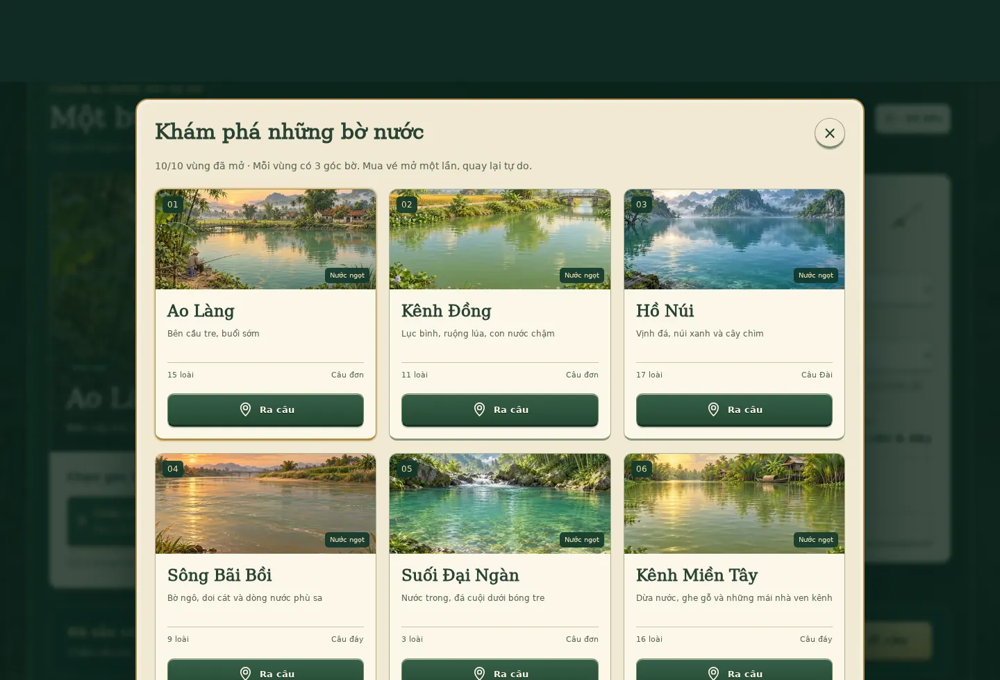
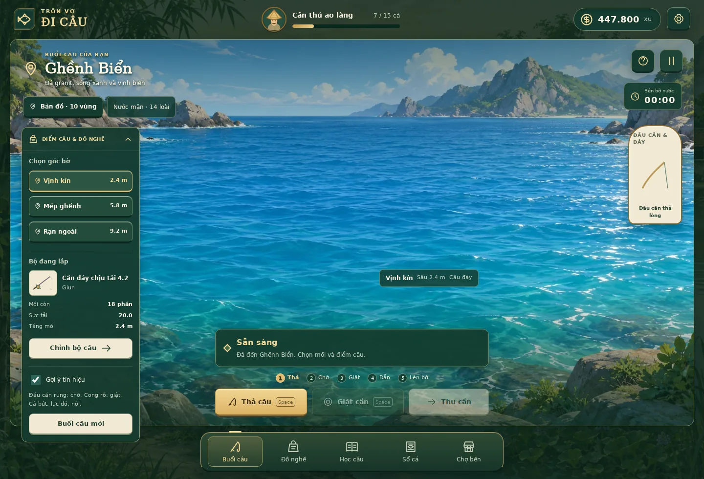
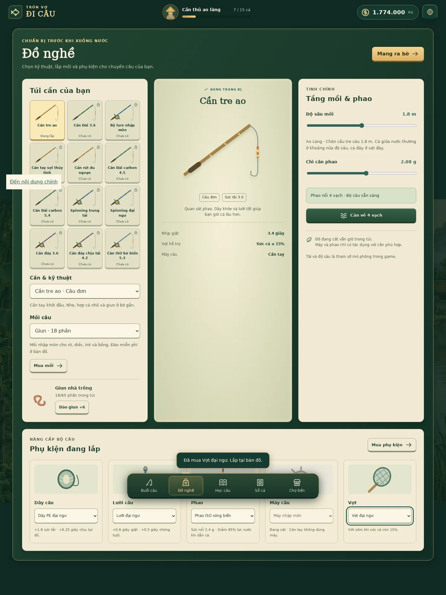

# Trốn Vợ Đi Câu — nội dung mở rộng v0.1

Bản chơi hiện có **50 loài cá, 10 map, 12 cần, 15 mồi và 20 phụ kiện**. Các định nghĩa chạy trong `src/content.js`; mua, lắp và câu dùng cùng engine. Bản lưu cũ tự nhận năm phụ kiện khởi đầu, giữ xu, map/cần đã mở, cá đã câu và cá đang chờ bán/thả.

## Bản đồ và ảnh cảnh

Mỗi map có ba góc bờ với độ sâu riêng. Mở bằng xu một lần, đi lại tự do. Map mô tả môi trường trong game, không xác định một địa danh khảo sát thực tế.

| Map | Cảnh và môi trường | Kỹ thuật gợi ý | Tranh nền |
|---|---|---|---|
| Ao Làng | Cầu tre, nhà ven ao, bình minh | Câu đơn | `assets/ao-lang.webp` |
| Kênh Đồng | Ruộng lúa, cầu nhỏ, lục bình | Câu đơn | `assets/maps/kenh-dong.webp` |
| Hồ Núi | Núi xanh, vịnh đá, cây chìm | Câu Đài | `assets/maps/ho-nui.webp` |
| Sông Bãi Bồi | Doi cát, bờ ngô, dòng phù sa | Câu đáy | `assets/maps/song-bai-boi.webp` |
| Suối Đại Ngàn | Nước trong, đá cuội, rừng tre | Câu đơn/lure | `assets/maps/suoi-dai-ngan.webp` |
| Kênh Miền Tây | Dừa nước, ghe gỗ, nhà sàn | Câu đáy/lure | `assets/maps/kenh-mien-tay.webp` |
| Hồ Dịch Vụ | Chòi câu, dù vải, hồ thả cá | Câu Đài | `assets/maps/ho-dich-vu.webp` |
| Lòng Đập | Vách núi, hồ sâu, cây khô | Câu đáy/lure | `assets/maps/long-dap.webp` |
| Cửa Sông | Bãi triều, rừng đước, nước lợ | ISO/lure | `assets/maps/cua-song.webp` |
| Ghềnh Biển | Đá granit, sóng xanh, vịnh biển | ISO/câu đáy/lure | `assets/maps/ghenh-bien.webp` |

Chín tranh mới tạo bằng **Imagegen tích hợp**, một ảnh cho mỗi map. Bộ prompt cuối: [data/map_art_prompts.json](data/map_art_prompts.json). Ảnh nền WebP rộng tối đa 1536 px; ảnh nhỏ rộng tối đa 480 px nằm ở `assets/maps/thumbs/`. Bản đồ, thẻ chợ và cảnh câu dùng đúng hình của cùng map. Chọn map/góc bờ ở Chuẩn bị rồi vào chế độ Đi câu riêng phủ toàn màn hình.

## Cá và cách tìm

Sổ cá hiển thị đủ 50 loài, tìm tên hoặc lọc vùng. Mỗi thẻ ghi tầng nước, mồi và kỹ thuật tương thích. Sáu nhóm dáng SVG cùng hoa văn vảy/sọc/chấm tạo sự khác biệt giữa cá chép, cá da trơn, cá thân dài, thát lát, cá thân tròn và nhóm cá săn mồi. Đây là minh họa, không phải tài liệu định danh.

Cá tồn tại trong quần thể trước lượt thả. Cá chỉ tiếp cận khi hợp mồi, kỹ thuật, điểm và tầng nước. Mồi lure cần bật thu; mồi tự nhiên mất một phần mỗi lượt, mồi giả đã mua được dùng lại. Đổi góc bờ tự đặt mồi sát đáy, có thể chỉnh lại để tìm cá giữa nước. Góc bờ đầu mỗi map ưu tiên cá nhỏ hơn; góc xa có thể gặp cá lớn.

## Cần, mồi và phụ kiện

12 cần chia thành năm kỹ thuật: câu đơn, Đài, lure, đáy và ISO. Cần đáy/lure hiển thị cận cảnh đầu cần và dây; đơn/Đài/ISO hiển thị phao. Phụ kiện có bốn cấp trong mỗi nhóm, bao gồm một món cơ bản miễn phí.

| Nhóm | Tác dụng thực tế trong mô phỏng |
|---|---|
| Dây | Cộng sức tải; tăng thời gian chịu lực đỏ trước khi đứt |
| Lưỡi | Tăng cửa sổ giật và thời gian chịu chùng trước khi tuột |
| Phao | Đổi sức nổi/cân chì; giảm phần lực nước khi dẫn cá bằng bộ dùng phao |
| Máy | Cộng sức tải và tăng tốc giảm sức cá; chỉ hoạt động với lure, đáy, ISO |
| Vợt | Đưa cá lên bờ khi sức cá còn 6%, 10% hoặc 15%, tùy vợt |

Chỉ mua/trang bị khi đã kết thúc lượt và xử lý cá vừa bắt. Mua vật phẩm sở hữu một lần bị chặn khi mua lại; mồi tự nhiên có thể mua nhiều gói. Ô phụ kiện đang cất giải thích vì sao cần hiện tại không dùng món đó. Chỉ đồ đã sở hữu mới chọn được; thay phao tự cân về bốn vạch.

15 mồi gồm 11 mồi tự nhiên và 4 mồi giả. Mồi mềm đi kèm cần lure; crankbait, thìa kim loại và popper mua một lần. Cần tre, phụ kiện cơ bản và giun miễn phí duy trì đường phục hồi khi hết xu.

## Kiểm chứng

25 test cơ chế, 19 nhóm kiểm tra trình duyệt cơ bản và 8 nhóm kiểm tra mở rộng đã đạt. Có kiểm tra tất cả 50 loài ở khối lượng tối đa, tính nguyên tử của giao dịch/trang bị, hiệu ứng phụ kiện, bản lưu cũ, vòng câu đáy thật và cả 10 tranh cảnh. Chi tiết ở [VERIFICATION.md](VERIFICATION.md).

Khối lượng, giá, phân bố và tập tính được cân bằng cho game. Dữ liệu nghiên cứu GDD vẫn có trạng thái chờ duyệt chuyên gia; bản mở rộng không xác nhận định danh/phân bố sinh học ngoài đời. Không có thay đổi thanh toán hoặc tiền thật.
