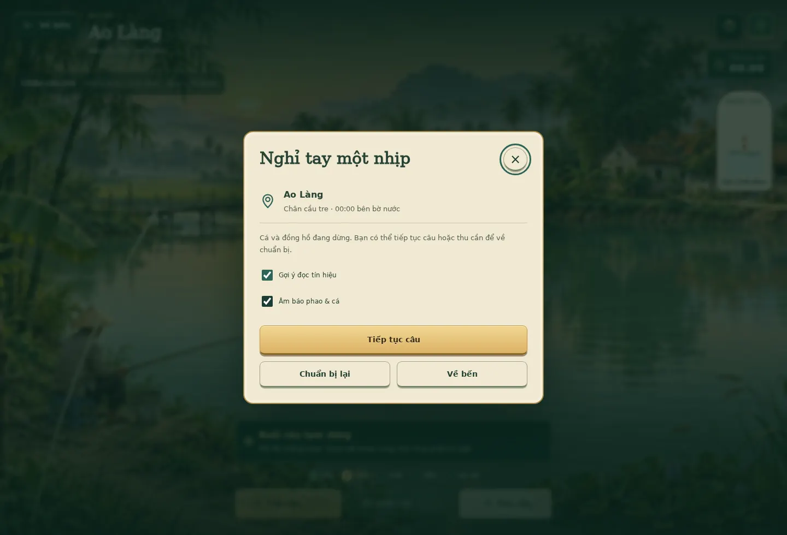

# Trốn Vợ Đi Câu — giao diện game v0.2

Một game câu cá Việt Nam với luồng Nhà → Chuẩn bị → Đi câu. Nhà chứa hành trình và các màn quản lý. Chuẩn bị chứa map, góc bờ, cần và mồi. Đi câu là hoạt động riêng phủ viewport; cảnh nước và nhịp câu là trung tâm.

## Phương pháp và quyết định

Dùng UIUX Pro Max: đã chạy truy vấn design-system `fishing game immersive adventure`, truy vấn style `game HUD skeuomorphism` và UX `touch controls minimum target`. Kết quả design-system thiên về trang giới thiệu sản phẩm, nên không dùng bố cục chuyển đổi/marketing. Kết quả Skeuomorphism phù hợp HUD game và vật liệu có chiều sâu: biên vàng đồng, nút có gờ, nền đồ nghề như giấy. Chọn xanh rêu, giấy ngà và vàng đồng hợp cảnh ao Việt Nam; không dùng màu tím hay font esports trong kết quả gợi ý.

`styles.css` và `src/ui.js` là phần trình bày. Bản mở rộng nối nội dung và phụ kiện qua `src/content.js`, `src/engine.js`; `src/save.js` di chuyển bản lưu cũ theo cách bổ sung, giữ key và tiến độ. Tokens cập nhật tại `data/design_tokens.json`. Lần tách chế độ đã đối chiếu UIUX Pro Max về phân cấp điều hướng, progressive disclosure, focus khi đổi màn và touch target; giữ vật liệu giấy/ngà, xanh rêu và vàng đồng của game.

## Hệ thiết kế

- Forest #163B30, deep #102A23, light #2C5542; chữ trên HUD #FCF5E5, phụ #C7D1BB.
- Vàng đồng #E4BD70 / #F5D998; nút chính dùng chữ tối #382B13.
- Giấy #F1E8D2, bề mặt #FCF5E5; chữ #284336, phụ #566454.
- Font Viet/DejaVu Sans cho nội dung, VietDisplay/DejaVu Serif cho tên game và tiêu đề; WOFF nhúng có dấu Việt. Không tải font ngoài.
- Nút thông thường 48 CSS px; nút gọn và nút biểu tượng điện thoại 44 CSS px. Viền focus 3px; hover/press giữ nguyên kích thước.
- SVG do dự án vẽ, nét 1.8; không dùng emoji điều hướng. Ảnh map nhỏ lấy từ đúng tranh cảnh, có bản WebP 480 px để tải nhẹ. Hình cá có sáu dáng và các hoa văn vảy, sọc, chấm.
- Giảm chuyển động tắt hiệu ứng báo cắn và transition; tín hiệu phao, chữ và nút vẫn dùng được.

## Các màn

| Màn | Thiết kế và thao tác |
|---|---|
| Nhà | Cảnh ao phủ khung, tiêu đề game, nút chơi lớn, 3 thẻ map gần đây và nút mở bộ chọn cả 10 vùng. Map mở đi vào Chuẩn bị; map khóa mở nhóm bản đồ tại chợ. Nhiệm vụ lấy từ cá, bài học và bộ sưu tập thật. |
| Chuẩn bị | Tranh map, bộ chọn cả 10 vùng, ba góc bờ; chọn cần/mồi đã sở hữu, xem tầng mồi và phụ kiện. Bộ chưa cân/hết mồi có hướng phục hồi; chỉ một nút chính Bắt đầu đi câu. |
| Đi câu | Cảnh phủ viewport, ẩn header và dock. Về nhà trái trên, pause/help phải trên; phao hoặc đầu cần/dây phóng đại bên phải, thao tác và lực dây đáy giữa. Nút Giữ để giật giữ nguyên vị trí qua lúc đóng lưỡi/dẫn; giữ tạo lực ngay, nhả nới lực. Không có bảng map/đồ nghề hoặc liên kết chợ/sổ cá trong cảnh. |
| Tạm dừng | Cá và đồng hồ dừng; Tiếp tục câu, Chuẩn bị lại, Về nhà. Thoát lượt đang chờ/cắn/dẫn cần xác nhận thu cần; không tiêu thêm mồi. Khi idle có thể bắt đầu buổi mới. |
| Đồ nghề | Ô cần có trạng thái sở hữu/trang bị, minh họa bộ hiện tại, chọn mồi và tinh chỉnh phao/tầng nước. Năm ô phụ kiện có hiệu ứng thật; máy/phao không tương thích hiện trạng thái đang cất. Ô khóa mở chợ cần. |
| Học câu | Ba thẻ nhiệm vụ, số thứ tự, thưởng lần đầu và trạng thái hoàn thành. Quiz có phản hồi, thử lại khi sai. |
| Sổ cá | Thẻ loài, trạng thái khám phá, số gặp, kỷ lục và map. Tìm kiếm tên cá, lọc map, gợi ý mồi/kỹ thuật/tầng nước và tiến độ 50 loài. |
| Chợ bến | Thẻ đồ, giá và sở hữu. Lọc tất cả/cần/mồi/phụ kiện/bản đồ; nhóm được giữ sau khi mua. |
| Cá lên bờ | Cửa sổ thành tích có hình cá, khối lượng, giá bán và lựa chọn bán/thả. Không đổi cách xử lý giao dịch. |

HUD tại nhà và các màn chuẩn bị/quản lý có số xu và cấp cần thủ. Cấp là cách trình bày tổng cá đã câu, tăng ở 5/15/30/60 con; không tạo thêm XP, thưởng xu hoặc yêu cầu thay đổi bản lưu. Thanh điều hướng đáy tại nhà có đúng năm mục; mục Đi câu mở Chuẩn bị, logo đưa về nhà. Deep link `#fishing` vẫn mở chế độ chơi riêng; `#prepare` mở chuẩn bị.

## Responsive và kiểm chứng

Đi câu dùng 100dvh, chừa safe area cho các điều khiển; không có dock hoặc bảng đồ ở dưới cảnh. Điện thoại dọc đặt điểm/mồi và tín hiệu phía trên, nhịp/điều khiển phía dưới. Màn hình ngang thu gọn thông tin; khi dẫn cá chỉ giữ lực dây, tiến độ và nút dẫn/nới. Chuẩn bị/quản lý vẫn cuộn, có khoảng chừa cho dock. Cho phép zoom 200% và thao tác bàn phím.

Pointer capture giữ thao tác khi ngón tay/chuột đi khỏi nút; pointerup/cancel/lostcapture, pause và blur đều xóa lực đang giữ. Phím Space/A dùng down/up, không bật/tắt. Màu vùng lực lấy cùng ngưỡng 25–83% của engine; đỏ từ trên 91%.

Dialog có focus trap, Escape, trả focus về trigger. Thao tác giữ đang kết thúc sau khi cá lên bờ không được kích hoạt nút hoặc đóng hộp kết quả; người chơi phải bắt đầu lần chạm mới trong hộp. Các nút biểu tượng có tên; hình trang trí ẩn khỏi cây trợ năng. Một vùng live thông báo thay đổi trạng thái, không đọc lại lực dây liên tục. Giữ giải pháp native cho range/select/checkbox.

34 test cơ chế, 19 nhóm kiểm tra trình duyệt cơ bản, 8 nhóm bản mở rộng và bộ hồi quy hai tay bằng chuột/cảm ứng/bàn phím, gồm lượt câu tự nhiên, bán một lần sau reload, bài học, mua/đào mồi, chọn map, ô khóa, bộ lọc chợ, cảm ứng, bốn viewport, zoom và reduced motion. Xem `VERIFICATION.md` cho phạm vi kiểm chứng.

## Phạm vi hình ảnh

10 cảnh chơi có tranh riêng: ruộng lúa, suối, hồ núi, lòng đập, kênh dừa, hồ dịch vụ, bãi bồi, cửa sông và biển bên cạnh ao khởi đầu. Đồ và cá là minh họa trong game; chưa phải định danh sinh học hoặc mô hình vật lý. Không giả nút multiplayer, dữ liệu người chơi, loot rarity, thanh năng lượng hay tính năng chưa triển khai.

## Điều khiển v0.2

Hai vùng trái/phải cố định qua lúc giật và dẫn. Tay trái bám dấu cá trong mặt phẳng 2D; tay phải giữ và kéo lên/xuống chỉnh lực liên tục. Chế độ dọc xếp thanh lực/tiến độ phía trên hai tay; màn hình ngang đặt ở giữa hai tay. Cận cảnh phao ẩn khi dẫn cá. Hỗ trợ hai pointer độc lập, chuột + bàn phím và bàn phím đầy đủ.

Cảnh nền được bổ sung mặt nước chảy, bọt, vật trôi và cành lá tiền cảnh theo từng map. Xem [TWO_HANDS.md](TWO_HANDS.md) để biết cơ chế và phạm vi.
